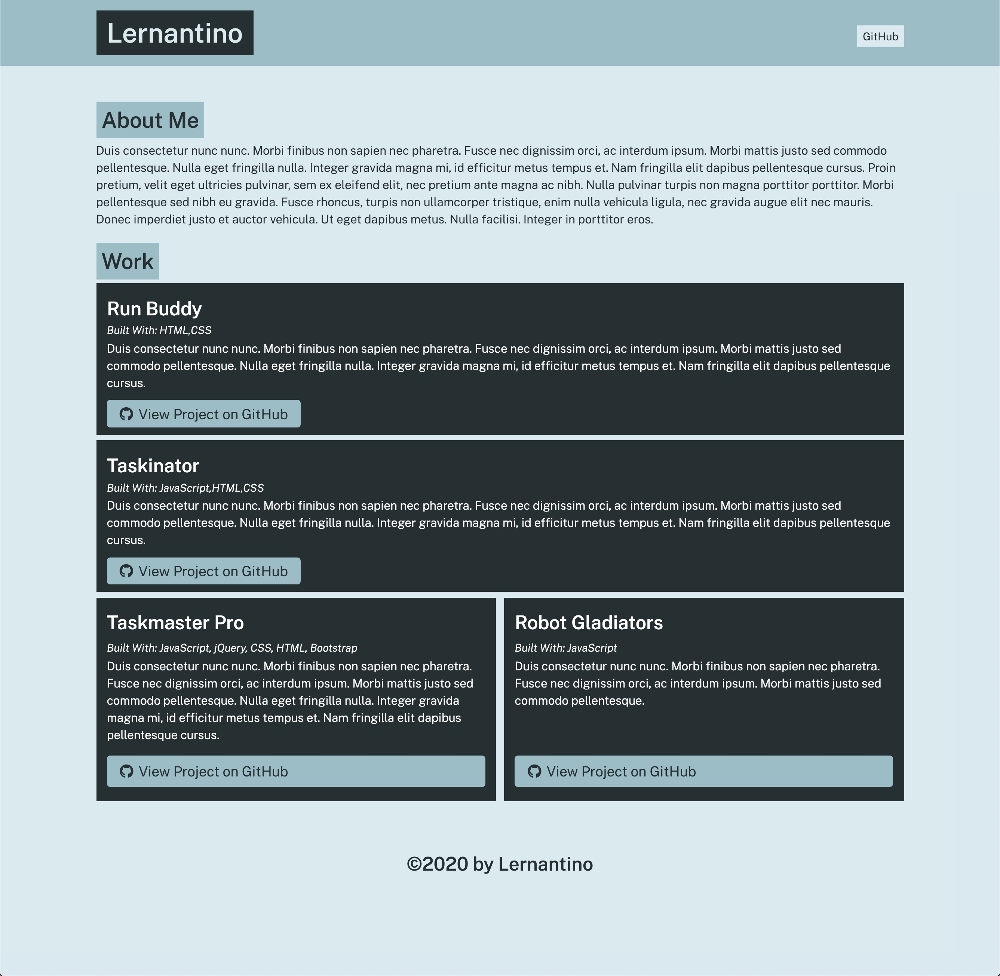

# Portfolio Generator

## 💬Description
This program was built to execute a Node.js application that accepts arguments from the command line in order to display different results that create an HTML portfolio page. 

## 🎨Mock-Up

## :pencil2:Built With
* HTML
* CSS
* Javascript
* JSON
* Bootstrap
* Node.js
* Google Fonts
* Font Awesome

## 🔌Installation
The user should clone the [repository](https://github.com/tpgent01/portfolio-generator) from GitHub and open up the project in the browser from the index file.

## 📌Contributing
Contributors should read the installation section.

## ❓Questions
If you have any questions about this projects, please contact me directly at tpgent01@outlook.com. 
You can view more of my projects at https://github.com/tpgent01 👾
